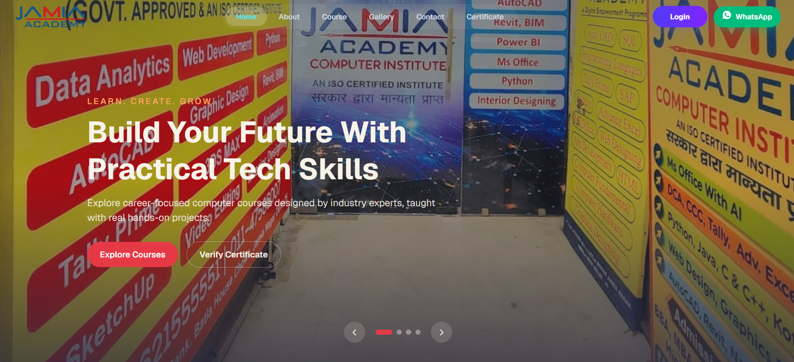
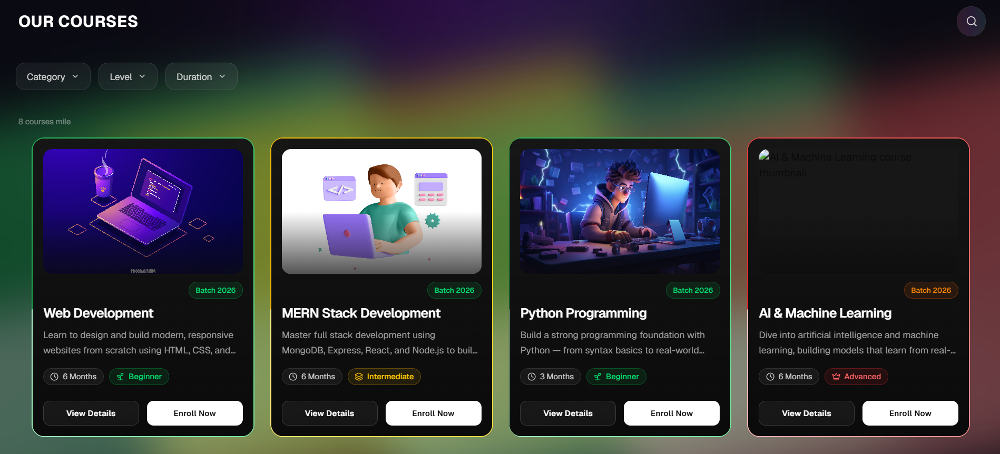
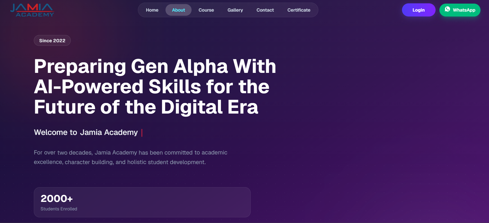
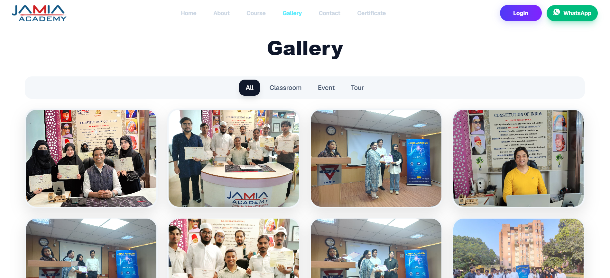

<div align="center">

# 🎓 JAMIA ACADEMY

### 🚀 Modern Skills, AI & Computer Training Institute — Jamia Nagar, Delhi

<br/>

<p>
  <a href="https://jamia-academy.vercel.app"></a>
  <a href="https://jamiaacademy.in"></a>
  <a href="https://github.com/abufazal460/Jamia-Academy"></a>
</p>

<p>
  
  
  
  
</p>

</div>

<br />

---

## 📸 Project Preview

> A quick look at the actual pages — homepage, courses, about, and gallery. *(Drop real screenshots into a `screenshots/` folder at the project root with these file names to have them show up here.)*

<table>
<tr>
<td width="50%">

**🏠 Home**


</td>
<td width="50%">

**📚 Courses**


</td>
</tr>
<tr>
<td width="50%">

**ℹ️ About**


</td>
<td width="50%">

**🖼️ Gallery**


</td>
</tr>
</table>

---

## 🚢 Deployment

The app is deployed on **Vercel** at [jamia-academy-product.vercel.app](https://jamia-academy-product.vercel.app). A `vercel.json` rewrite rule routes all paths to `index.html`, keeping client-side routing (React Router) working correctly on refresh and direct links.

The production domain, **[jamiaacademy.in](https://jamiaacademy.in)**, is registered and managed through Hostinger and points to the Vercel deployment.

---

---

## 📖 Project Overview

**Jamia Academy** is the website for an offline, hands-on training institute in **Jamia Nagar, Okhla, Delhi** — run by PhD alumni and built around modern, practical skills rather than just theory.

The course list covers a lot of ground: **basic and advanced computer courses, Tally, Advanced Excel, graphic design, animation, web development, AI and computer science, and digital marketing** — and students aren't locked into picking just one. Someone can take Tally and Advanced Excel together in the same batch if that's what fits their goal. Every course is built to be practical and job-oriented — real hands-on projects, current AI tools worked into the curriculum where relevant, an industry-focused approach, and a certificate once the course is completed. The institute's accreditations include **Government approval, ISO certification, Skill India, and MSME recognition**.

> This repository is the **frontend** for that institute — the part visitors actually see and interact with before they walk in or message on WhatsApp to enroll. It's built to load fast, look sharp on any screen from a small phone to a 4K monitor, and rank well in search, while still being animated and expressive enough to feel like a modern product rather than a plain brochure site.

---

## ✨ Features

- 🎬 **Fully animated, high-performance UI** — page transitions, scroll-triggered reveals, and hover interactions run on Framer Motion and GSAP without dragging down load times
- 🎮 **Gaming-inspired course cards** — the course catalog uses an animated-border, gaming-style card treatment (glowing edges, level badges, hover motion) while staying clean and easy to read — it's meant to look bold, not busy
- 🖼️ **Heavy-animation gallery page** — tabbed photo gallery (classroom / event / tour) with a fullscreen lightbox, built to feel smooth even with a large number of images
- 🌊 **Buttery smooth scrolling** site-wide via Lenis, tied into the animation timing so scroll and motion stay in sync instead of fighting each other
- 🔍 **SEO built in, not bolted on** — every page ships its own title, meta description, canonical tag, Open Graph/Twitter cards, and JSON-LD structured data, aimed at a 95+ SEO score
- 📱 **Fully responsive, 320px to 4K** — tested down to small phones and up through large desktop monitors, not just the usual mobile/tablet/desktop breakpoints
- 🗂️ **Zero hardcoded content** — every course, testimonial, FAQ, and gallery image is pulled from a dedicated `data/` file per feature and rendered through a map/loop, so updating content never means touching component code
- ⚡ **Optimized images everywhere** — lazy loading, async decoding, and priority hints so heavy image sections (gallery, course thumbnails) don't tank performance
- 💬 **WhatsApp-based enrollment** — course details get turned into a pre-filled WhatsApp message, so a student can go from "interested" to "chatting with the institute" in one tap
- 🏗️ **Production-ready build** — route-level code splitting, reduced-motion support, and a lean bundle set up for real-world deployment, not just a demo

---

## 📄 Pages

| Page | Route | What's there |
|---|---|---|
| **🏠 Home** | `/` | The first impression — hero, accreditations, feature highlights, testimonials, "Why Choose Us," an FAQ, and a preview of the course gallery |
| **ℹ️ About** | `/about` | The institute's story — founders, co-founder, vision & mission, values, stats, faculty, and a timeline of how it got here |
| **📚 Courses** | `/course` | The full catalog — every course with its duration, level, modules, and a direct WhatsApp enroll button |
| **🖼️ Gallery** | `/gallery` | Photos from real classrooms, events, and tours, sorted into tabs with a fullscreen lightbox |
| **📞 Contact** | `/contact` | Contact form, social links, location map, and reasons to actually reach out |
| **🎓 Certificate** | `/certificate` | Where students will verify a certificate once the backend is live (details below) |
| **🔐 Admin Panel Login** | `/login` (noindex) | Login screen for the institute's admin — not a student login |

---

## 🎨 Design & UI

Nothing here is copied from another website. A few sites were looked at for general inspiration — the way any designer browses around before starting — but the actual layout, typography pairing, and every color value in this project came out of a lot of manual trial and error, not a template or an AI color-generator.

The color palette especially took a while to lock in. It went through several rounds — pick a shade, apply it across a few components, look at it next to the other colors, decide it's slightly off, adjust the value, apply again — repeated until the terracotta-and-charcoal combo actually felt right together instead of just "fine."

Typography went through the same back-and-forth — trying a few pairings before settling on **Poppins** *(self-hosted, weights 300–700 including italics)* as the one that read well at both hero-heading size and small body text without feeling generic.

On top of that base, the UI is built with `class-variance-authority` and `tailwind-merge` for consistent variants, and `lucide-react` / `react-icons` for iconography. The course section leans into a gaming-inspired look — animated borders, level badges, glowing hover states — while the rest of the site stays calmer and more readable, so the "gamified" feel adds personality without hurting usability.

---

## 📱 Responsive Design

Built **mobile-first** and tested across the full range — small phones around 320px wide, tablets, laptops, and large 4K desktop monitors — using Tailwind's responsive utilities (`sm:`, `md:`, `lg:`, `2xl:`, etc.) plus dedicated `useMediaQuery` and `useIsMobile` hooks for behavior that needs to branch in JavaScript instead of CSS alone.

---

## 🛠️ Tech Stack

**⚛️ Frontend**
- React 19
- React Router DOM 7
- Vite 6
- Tailwind CSS 4 (`@tailwindcss/vite`)

**🧩 UI & Components**
- `@base-ui/react`
- `class-variance-authority`, `clsx`, `tailwind-merge`
- `lucide-react`, `react-icons`

**🎞️ Animation**
- **Framer Motion** / `motion`
- GSAP
- Lenis (smooth scroll)
- `tw-animate-css`
- `react-intersection-observer`

**🗃️ Data & Utilities**
- `fuse.js` (fuzzy search)
- `react-countup`

**🔍 SEO**
- `react-helmet-async`

**🧰 Version Control & Tooling**
- Git
- GitHub
- ESLint 9 (flat config)
- TypeScript type definitions for React (`@types/react`, `@types/react-dom`)
- npm

**☁️ Hosting & Deployment**
- Vercel (app hosting/deployment)
- Hostinger (domain — jamiaacademy.in)

---
📂 Project Structure

This project follows a feature-based folder structure — instead of grouping files by type (all components in one giant folder, all hooks in another), everything related to one feature lives together: its components, its data, its hooks, and its motion/animation variants all sit inside that feature's own folder. Opening features/courses/ gives you the entire courses feature in one place — nothing scattered across the codebase to go hunting for.

This pays off in a few real ways: a new page or feature can be added without touching unrelated code, content updates only ever happen inside a feature's data/ folder (never inside a component), and anyone jumping into the codebase for the first time can understand what a feature does just by opening its folder — no need to trace imports across the whole src/.
```
frontend/
├── public/                    # favicon, robots.txt, sitemap.xml, manifest
└── src/
    ├── app/                    # app shell — routing, providers, page transitions, intro loader
    ├── assets/                 # fonts (Poppins, Geist, Inter, Orbitron), icons
    ├── features/               # 👉 one folder per feature — each with its own components/, data/, hooks/, motion/
    │   ├── about/
    │   ├── auth/               # admin panel login
    │   ├── certificate/
    │   ├── contact/
    │   ├── courses/
    │   ├── gallery/
    │   ├── home/
    │   └── not-found/
    ├── pages/                  # thin route-level components — wire a feature to a URL
    │   ├── HomePage.jsx
    │   ├── AboutPage.jsx
    │   ├── CoursesPage.jsx
    │   ├── GalleryPage.jsx
    │   ├── ContactPage.jsx
    │   ├── CertificatePage.jsx
    │   └── LoginPage.jsx
    ├── shared/                 # reused across features
    │   ├── components/         # Navbar, Footer, Layout
    │   ├── constants/          # breakpoints, colors, routes, typography
    │   ├── hooks/               # useMediaQuery, useLenisScroll, useParallax...
    │   ├── motion/               # shared animation variants
    │   ├── seo/                  # SEO.jsx, OrganizationSchema.jsx
    │   └── utils/                 # whatsapp.js, validation.js, image.js...
    └── style/
        └── global.css           # design tokens, fonts, Tailwind theme
```
<br/>

## 🚀 Performance & SEO

**⚡ Performance**
- Route-level code splitting via `React.lazy` + `Suspense` on every page
- Lazy-loaded images with async decoding and priority hints (`getImageProps` helper) — important given how image-heavy the gallery and course sections are
- Section-level lazy loading for heavier below-the-fold components (e.g. `FacultyGrid`, `WhyChooseUs`, `TimelineSection` on the About page)
- Reduced-motion detection so animation scales back for users who prefer it
- Built and tuned to be production-ready, not just "works on my machine"

**🔍 SEO**
- Per-page `<title>`, meta description, and canonical URL via `react-helmet-async`
- Open Graph and Twitter Card tags on every public page
- JSON-LD structured data — `EducationalOrganization` + `WebSite` schema site-wide, plus `Course`, `ContactPage`, and `WebPage` schema on their respective pages
- `robots.txt` and `sitemap.xml` served from `public/`
- `noindex` on the admin login page
- Target: 95+ SEO score across core pages

---

## ⚙️ Installation

### 1️⃣ Clone the repository

```bash
git clone https://github.com/abufazal460/Jamia-Academy.git
cd Jamia-Academy/frontend
```

### 2️⃣ Install dependencies

```bash
npm install
```

### 3️⃣ Run the development server

```bash
npm run dev
```

---

## 🔐 Environment Variables

> No environment variables are needed to run the frontend locally — content lives directly in the codebase under `src/features/*/data` and `src/shared/constants`. This will change once the backend and database are connected (see Future Improvements).

---

## 📜 Available Scripts

| Script | Description |
|---|---|
| `npm run dev` | Start the Vite development server |
| `npm run build` | Build the app for production |
| `npm run preview` | Preview the production build locally |
| `npm run lint` | Run ESLint across the project |


## 🔮 Future Improvements

- 🎓 **Certificate verification (backend + database)** — the `/certificate` page exists today, but it isn't connected to anything real yet — there's no backend or database behind it. That's actively being planned and is expected to start soon. Once it's live, a student's record will sit in a database, and entering their certificate details on the page will pull up their actual certificate, which they'll be able to view, verify, and download.
- 🔐 **Admin panel & dashboard** — alongside the certificate backend, an admin panel is planned behind the `/login` page. Once built, the institute admin will be able to log in and add, edit, or delete courses, and manage the website's content directly from a dashboard — full control without touching code.
- 🖼️ Expanding the gallery and course content as new batches and events come in

---

## 👤 Author

**Abu Fazal**

[](https://github.com/abufazal460)

---

## 📄 License

No license file is currently included in this repository. All rights reserved unless a license is added.
